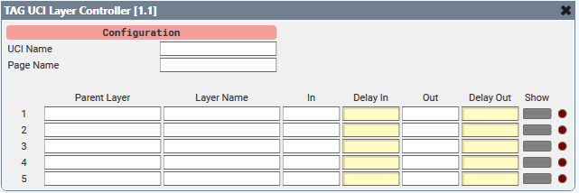

# TAG UCI Layer Controller

This is a Q-SYS Plugin intended to provide an alternative to the native *UCI Layer Controller* that is more feature-rich.
> This plugin is intended to provide *only* this extended functionality. Further functionality such as *radio groups* should be achieved through using a *selector* that drives the control pins of the desired layers.

> Bug reports and feature requests should be sent to Jason Foord (jf@tag.com.au).

## How do I get set up?

See [Q-SYS Online Help File - Plugins](https://q-syshelp.qsc.com/#Schematic_Library/plugins.htm)

## Notable features

* UCI data is pulled from the design file and presented in a combo box format for all configurable UCI-related fields.
* Discrete *In* and *Out* transitions.
* Ability to configure a parent layer for each row.
> Parent layers can be nested to create a cascading heirarchy of logical parents.
* Child layers inherit the parent's transitions when the parent layer's visibility is set/reset.
* Native error detection if the configured fields are not available in the current UCI.
> Changing the UCI does not clear configurations, thus avoiding accidental clearing of the layers. Instead, the text fields will turn **Red**.
> Layers cannot be configured as their own parent, and multiple rows cannot have the same child layer configured. The plugin will clear the duplicate if this configuration is attempted.

## Properties

#### # Layers

*1 - 200*

The number of configurable layer rows.
> The order of configured layers is irrelevant - each row should be thought of as an independant entity.

## Controls

### Main Page

#### UCI Name

The Name of the selected UCI.

#### Page Name

The Page of the selected UCI Name.

#### Layer Controls

> ##### Parent Layer

> The layer that is referenced to determine the visibility and transition inheritance of *this* layer.

> ##### Layer Name

> The layer to be affected by this row.

> ##### In

> The discrete *In* transition for this layer.

>> This transtition will be used for layers that have this layer configured as a parent, if *this* layer triggers the visibility change.

> ##### Out

> The discrete *Out* transition for this layer.

>> This transtition will be used for layers that have *this* layer configured as a parent, if *this* layer triggers the visibility change.

> ##### Show

> Toggles the intended visibility of *this* layer.

>> If a parent layer is configured, the visibility of this layer is determined through a logical ***AND*** operation of the parent's *visibility* state and *this* layer's 'show' state.

> ##### Visible

> If this layer is currently visible.